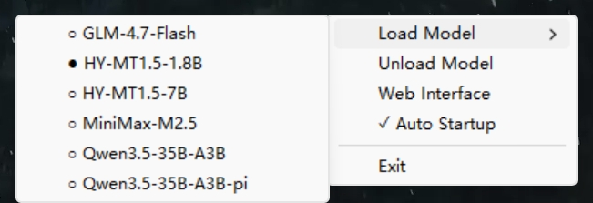

# lmgo



[中文版 README](README_zh.md)

lmgo is a suite of tools for running local LLM models using llama.cpp server with **ROCm** GPU acceleration. It includes:

- **lmgo**: System tray application for Windows with model management
- **lmc**: Terminal-based control interface using BubbleTea

Both tools are specifically optimized for systems with **AMD RYZEN AI MAX+ 395 / Radeon 8060S graphics**.

## System Requirements

**This application only works on:**

- **Operating System:** Windows 11
- **Processor:** AMD RYZEN AI MAX+ 395
- **Graphics:** Radeon 8060S
- **Architecture:** x86_64

The embedded llama-server is compiled specifically for ROCm GFX1151 architecture and will not work on other hardware configurations.

## Features

### lmgo (System Tray)

- **System Tray Interface**: Runs in the Windows system tray for easy access
- **Automatic Model Discovery**: Scans directories for .gguf model files
- **Single Model Support**: Load and run one model at a time
- **Web Interface**: Built-in web interface for each loaded model
- **Auto-start on Boot**: Option to start automatically with Windows
- **Notifications**: Windows toast notifications for model status
 - **Multi-Configuration Support**: Multiple configurations for the same model, each displayed as a separate option
 - **Automatic Web Browser Launch**: Option to automatically open web interface when models load
 - **Model Exclusion Patterns**: Support for excluding specific models or folders using glob patterns

 ### lmc (Terminal UI)

- **Terminal Interface**: TUI-based model management with keyboard shortcuts
- **Real-time Status**: Live display of model loading/unloading status
- **API Integration**: Communicates with lmgo's REST API for model control
- **Key Bindings**: Intuitive keyboard controls (Arrow keys, Enter, U, Q)
- **Multi-Configuration Support**: Displays all model configurations as separate entries


## Configuration

The application creates a `lmgo.json` configuration file with the following structure:

  ```json
{
  "modelDir": "./models",
  "autoOpenWebEnabled": true,
  "basePort": 8080,
  "llamaServerPort": 8081,
  "defaultArgs": [
    "--host", "0.0.0.0",
    "--prio-batch", "3",
    "--no-host",
    "--ctx-size", "131072",
    "--batch-size", "4096",
    "--ubatch-size", "4096",
    "--threads", "0",
    "--threads-batch", "0",
    "-ngl", "999",
    "--flash-attn", "on",
    "--cache-type-k", "f16",
    "--cache-type-v", "f16",
    "--kv-offload",
    "--no-mmap",
    "--no-repack",
    "--direct-io",
    "--mlock",
    "--split-mode", "layer",
    "--main-gpu", "0"
  ],
  "modelSpecificArgs": [],
  "excludePatterns": []
}
  ```

 ### Configuration Options

 - **modelDir**: Directory containing .gguf model files
 - **autoOpenWebEnabled**: Automatically open browser when model loads
 - **basePort**: API server port (default: 8080) - used by lmc and HTTP API
 - **llamaServerPort**: llama-server port (default: 8081) - where models run
 - **defaultArgs**: Default arguments passed to llama-server
  - **modelSpecificArgs**: Array of model configurations, allowing multiple configurations per model
 - **excludePatterns**: List of glob patterns to exclude models from the list (similar to .gitignore)

 ### Multi-Configuration Support

You can define multiple configurations for the same model, each displayed as a separate option in the menu and API:

```json
"modelSpecificArgs": [
  {
    "name": "Llama-3 (Fast Mode)",
    "target": "Llama-3-8B-Instruct",
    "args": ["-ngl", "10", "-c", "2048", "--batch-size", "512"]
  },
  {
    "name": "Llama-3 (Long Context)",
    "target": "Llama-3-8B-Instruct",
    "args": ["-ngl", "99", "-c", "32768"]
  },
  {
    "name": "Qwen2.5-7B (Optimized)",
    "target": "Qwen2.5-7B-Instruct",
    "args": ["-ngl", "35", "-c", "8192", "--batch-size", "1024"]
  }
]
```

**Note:** When a model has configurations defined in `modelSpecificArgs`, the default configuration is not shown as an option.

### Exclude Patterns Examples

You can exclude specific models or folders using glob patterns:

```json
"excludePatterns": [
  "mmproj-35B-F16.gguf",           // Exclude specific file
  "*-test.gguf",                   // Exclude all test models
  "experimental/*",                // Exclude entire folder
  "backup/**/*.gguf"              // Exclude all .gguf files in backup subfolders
]
```

Patterns support:
- `*` matches any sequence of non-separator characters
- `?` matches any single non-separator character
- `[abc]` matches any character in the set
- `**` matches zero or more directories

 ### API Endpoints

- `GET /api/models` - List all available models and configurations
- `GET /api/status` - Get current model status
- `POST /api/load?index=N` - Load model at index N (includes configurations as separate indices)
- `POST /api/unload` - Unload current model
- `GET /api/health` - Health check

**API Response Example:**
```json
{
  "success": true,
  "data": [
    {
      "index": 0,
      "modelIndex": 0,
      "configIndex": 0,
      "name": "Llama-3 (Fast Mode)",
      "path": "D:/LLM/Llama-3-8B-Instruct.gguf",
      "filename": "Llama-3-8B-Instruct.gguf",
      "hasConfig": true,
      "configName": "Llama-3 (Fast Mode)"
    },
    {
      "index": 1,
      "modelIndex": 0,
      "configIndex": 1,
      "name": "Llama-3 (Long Context)",
      "path": "D:/LLM/Llama-3-8B-Instruct.gguf",
      "filename": "Llama-3-8B-Instruct.gguf",
      "hasConfig": true,
      "configName": "Llama-3 (Long Context)"
    }
  ]
}
```

# 

## Building lmgo (System Tray)

Download the latest [`llama-b*-windows-rocm-gfx1151-x64.zip`](https://github.com/zyoung11/lmgo/releases) file from [releases](https://github.com/zyoung11/lmgo/releases) first and then

```bash
go mod tidy
go build -ldflags "-s -w -H windowsgui" -buildvcs=false .
```

 ## Building lmc (Terminal UI)

```bash
cd lmc
go mod tidy
go build -buildvcs=false .
```

### lmc Configuration

lmc uses an embedded configuration file `baseURL.json` that specifies the lmgo API endpoint:

```json
{
  "baseURL": "http://127.0.0.1:9696"
}
```

**Note:** lmc automatically displays all model configurations from lmgo as separate entries in the terminal interface. Each configuration appears as an independent model option.

# 
